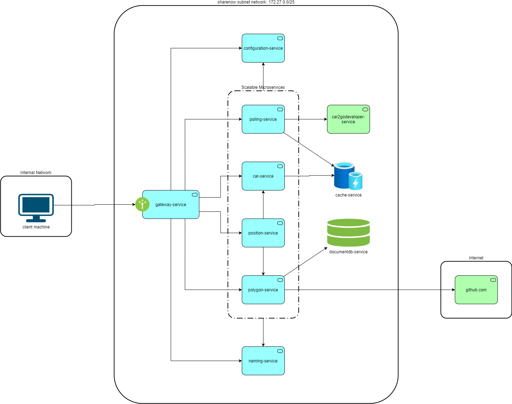

# SHARE NOW - JAVA CODING CHALLENGE

---
### PREFACE
I had a lot of fun in completing this challenge because of the wide variety of topics that it covers ranging from architecture to system design to data analysis and modelling to considering performance and automating deployments. It was indeed a pleasure for me to have been offered this challenge as it tested my knowledge, and skills while giving me an idea on the kind of work that sharenow does.

---
### TECHNOLOGY STACK
| Technology | Implementations/Frameworks | Version | Purpose |
| ----------- | ----------- | ----------- | ----------- |
| Java | Hotspot VM | 11 | JVM |
| Java | Spring Boot | 2.3.x | REST API framework |
| Java | Spring Cloud | Hoxton | Microservice framework|
| Java | Java Topology Suite | 1.14 | Geometric algorithms |
| Java | Open Zipkin |  2.23.3-SNAPSHOT | Distributed tracing |
| Java | JUnit | 5 | Unit testing |
| Java | Maven | 3.6.x | Build artifacts and execute tests |
| NoSQL | Redis | 3.0.x | Data caching for fast reads |
| NoSQL | MongoDB | 4.4 | Data store for nested schema |
| Virtualization | Docker | 20.10.5 | Platform agnostic containerization |
| OpenAPI | Swagger | 2 | REST API Documentation |

---
### MINIMUM SYSTEM REQUIREMENTS
1.  Disk - 4 GB
2.  Memory - 4 GB
3.  Processor - 2 CPU
4.  Network - 80 MBps
5.  Operating System - Ubuntu 20.4 or Windows 10
6.  JDK - 11
7.  Python - 3.9
8.  Maven - 3.6.x
9.  Docker - 20.10.x
10. Docker Compose - 1.28.x

---
### STEPS TO RUN - MANUALLY
1.  Open terminal or command prompt
2.  Go to the root folder of the project `sharenow-coding-challenge` containing the source code for all services
3.  Execute `mvn clean package -e` at the root folder containing all the projects to download dependencies, build the artifacts and create docker images of the respective services
4.  Execute `docker-compose -f docker-compose.infrastructure.yml up` at the root folder containing all the projects to start the infrastructure services for the microservice ecosystem
5.  If prompted for `Continue with the new image? [yN]` during the docker-compose step, enter y
6.  Browse to `http://<HOST_SYSTEM-IP>:8761` or `http://localhost:8761` or `http://172.27.0.6:8761` in a browser to see if EUREKA server is up or not
7.  Browse to `http://<HOST_SYSTEM-IP>:8888/actuator/info` or `http://localhost:8761/actuator/info` or `http://172.27.0.6:8761/actuator/info` in a browser to see if configuration  server is up or not which is denoted by a blank page and no errors
8.  Wait for EUREKA and configuration server to become healthy
9.  Execute `docker-compose -f docker-compose.core.yml up` at the root folder containing all the projects to start the core microservices
6.  If prompted for `Continue with the new image? [yN]` during the docker-compose step, enter y
7.  Browse to `http://<HOST_SYSTEM-IP>:8761` or `http://localhost:8761` or `http://172.27.0.6:8761` in a browser to see if the all the services are available in EUREKA server or not
8.  Access the Swagger documentation of individual core microservices viz., car, polygon, position in a browser to execute requests as desired over `http://<HOST-SYSTEM-IP>:8081/<SERVICE-NAME>/<SERVICE-CONTEXT-PATH>/swagger-ui.html`

---
### STEPS TO STOP - MANUALLY
1.  Open terminal or command prompt
2.  Go to the root folder of the project `sharenow-coding-challenge` containing the source code for all services
3.  Execute `docker-compose -f docker-compose.infrastructure.yml down` at the root folder containing all the projects to kill the containers of the infrastructure services for the microservice ecosystem
4.  Execute `docker-compose -f docker-compose.core.yml down` at the root folder containing all the projects to kill the containers of the core microservices

---
### ARCHITECTURE
[Click here to see](https://i.ibb.co/R0dzhpT/sharenow-coding-challenge-architecture.png)

---
### FEATURES
1. Search for a car by its VIN and get the strategic polygon details that it is currently mapped to
2. Search for a strategic polygon by its id and get the list of cars that it currently contains
3. Search for strategic polygons by a name apttern and collect all the cars that each matched strategic polygon contains
4. Error reporting with codes and descriptive messages 

---
### PROJECT DESCRIPTION
| SERVICE NAME | FUNCTIONALITY | TYPE |
| ----------- | ----------- | ----------- |
| configuration-service | Centralized configuration store for all microservices | Maven Project |
| naming-service | Service registration and discovery for all microservices by their name| Maven Project |
| gateway-service | Single entry point to provided accessibility for all microservices by their API, routes request to appropriate microservices | Maven Project |
| polling-service | Periodically refreshes live car locations for Stuttgart and puts them into the cache, Evicts cars using a custom least recently updated eviction policy | Maven Project |
| car-service | Query for cars and their details from cache for Stuttgart | Maven Project |
| polygon-service | Query strategic polygons and their details for Stuttgart | Maven Project |
| position-service | Maps cars to its enclosing strategic polygon using its vin, Collects all cars present within a strategic polygon by its id | Maven Project |
| cache-service | Stores live data for cars from Stuttgart and evicts data having TTL set against its key | Docker Image 
| documentdb-store | Stores strategic polygons for Stuttgart and their details | Docker Image 
| tracing-service | Trace requests across microservices for debugging | Docker Image 
| car2godeveloper-service | Provides live locations of cars in Stuttgart | Docker Image |

---
### ASSUMPTIONS
1. All business logic is written specifically for Stuttgart
2. No two strategic polygon intersects
3. Any car on the edge of a strategic polygon's boundary, will be considered within the polygon
4. polling-service is expected to be a daemon service that is concerned with writing to a data store only, hence it doesn't need horizontal scaling but rather vertical scaling if at all required to be more performant
5. JAVA_HOME and MAVEN_HOME is set on the host system
6. car2godeveloper/api-for-coding-challenge has been treated as a black box with only documentation available to use it as required

---
### FUNCTIONAL DECISIONS
1. Cars can be queried either by their VIN or all the ones currently available at once
2. Strategic polygons can be queried by their id or name or all available ones at once
3. A car that is not within any of the strategic polygon will be deemed as unavailable
4. A strategic polygon will report no cars available if it can't place any car within itself at any given point in time

---
### TECHNICAL DECISIONS
1. All other services except for polling-service should scale horizontally to keep up with dynamic load in favour of being high performant
2. Swagger has only been enabled for services that define the core business logic viz., car, polygon, position
3. Unit tests have been written to assert the business logic of core microservices viz., car, polygon, position 
4. polling-service is intended to be write intrinsic while car-service is intended to be read intrinsic through a distributed workflow spanning across two microservices and integrated using a cache (redis). This has been done to avoid bottle-neck and any single point of failure.
5. Each microservice is a spring boot application following the pattern of controller, service and repository, where repository can be either a database or an external service as per the respective microservice's use case
6. Scheduled service follows the pattern of input, process, and output like batch jobs
7. Functional interfaces have been defined in each microservice to perform one off business logic
8. All business specific exceptions are checked exceptions having a custom message and an enum based error code which in turn contains a prdefined application specific error code in the format `SNCC-<INITIALS-OF-SERVICE-NAME>-<INCREMENTING-NUMBER>` and its corresponding HTTP Status code
8. Each microservice has a REST webservice error handler that catches any business specific exception to translate them into appropriate error messages and HTTP status codes
9. Sleuth and Zipkin has been added to each of the core microservices for the purpose of tracing distributed requests across multiple microservices
10. Application specific configuration changes are loaded and propagated downstream in the order as follows: java system variables, bootstrap.properties, application-<PROFILE>.properties in configuration server

---
### REST API DOCUMENTATION
| SERVICE-NAME | API DOCUMENTATION URL |
| ----------- | ----------- |
| car-service | http://<GATEWAY-SERVICE-IP>:8081/car-service/car/swagger-ui.html) |
| polygon-service | http://<GATEWAY-SERVICE-IP>:8081/polygon-service/polygon/swagger-ui.html) |
| position-service | http://<GATEWAY-SERVICE-IP>:8081/position-service/position/swagger-ui.html) |

---
### ISSUES/ENHANCEMENTS
1.  Implement circuit breaker
2.  Block direct access to all microservices
3.  Enable security on all microservices
4.  Enable authentication of redis cache and mongodb database server 
5.  Encrypt security credentials in configuration store
6.  Move collection of configuration files for all microservices to an external location on the file system instead of having it embedded
7.  Redis should be configured for master-slave where master is write concern and all slaves are read concerns with eventual consistency between them 
8.  The algorithm to place cars within strategic polygons by matching the name of startegic polygons, has a time complexity of O(n^2) which should be reduced for better performance

---
### ADDITIONAL RESOURCES
1. In the `scripts` folder under the root folder `sharenow-coding-challenge` you will find the postman collection corresponding to all the REST APIS defined for each microservice in this entire project. You can use it as well if needed.